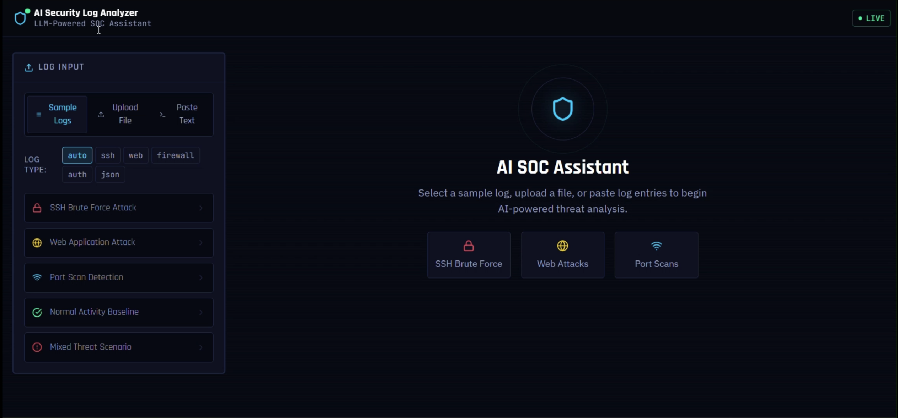

# 🛡️ AI Security Log Analyzer

### LLM-Powered SOC Assistant — Detect. Analyze. Report.

> A full-stack Security Operations Center (SOC) tool that ingests raw security logs, detects threats using rule-based heuristics, and delivers deep AI-powered analysis, severity scoring, and formal incident reports with **MITRE ATT&CK** mappings — all in a real-time cybersecurity dashboard.

<br/>



<br/>

---

## 📌 Table of Contents

- [Overview](#-overview)
- [Live Features](#-live-features)
- [Tech Stack](#-tech-stack)
- [Architecture](#-architecture)
- [Project Structure](#-project-structure)
- [Threat Detection Rules](#-threat-detection-rules)
- [LLM Analysis Layer](#-llm-analysis-layer)
- [AI SOC Report](#-ai-soc-report)
- [Sample Datasets](#-sample-datasets)
- [API Reference](#-api-reference)
- [Getting Started](#-getting-started)
- [Docker Deployment](#-docker-deployment)
- [Environment Variables](#-environment-variables)
- [Security Hardening](#-security-hardening)
- [MITRE ATT&CK Coverage](#-mitre-attck-coverage)
- [Resume Highlights](#-resume-highlights)

---

## 🔍 Overview

Most security log analysis requires expensive SIEM platforms or manual analyst work. This project bridges that gap by combining **rule-based threat detection** with **LLM intelligence** to simulate what a Tier-1 SOC analyst would do when triaging an incident.

The system:
1. Accepts logs in multiple formats (SSH, web server, firewall, application, JSON)
2. Parses and normalizes every line into structured events
3. Runs 7 detection algorithms to surface threats
4. Feeds results to an LLM for narrative analysis, severity scoring, and remediation advice
5. Optionally generates a full, printable **SOC Incident Report** with MITRE ATT&CK mappings

It is designed to be **modular**, **provider-agnostic** (swap Anthropic → OpenAI → local Ollama via one env variable), and **security-hardened** from day one.

---

## ✨ Live Features

### 🗂️ Log Input — Three Ways to Ingest
| Mode | Description |
|------|-------------|
| **Sample Logs** | 5 pre-built attack scenarios ready to run instantly |
| **Upload File** | Drag-and-drop `.log`, `.txt`, or `.json` files (up to 10MB) |
| **Paste Text** | Paste raw log lines directly into the editor |

Supported log types: `SSH auth`, `Apache/Nginx web`, `UFW/iptables firewall`, `application`, `JSON structured`

---

### 🔎 Threat Detection Engine
- ✅ SSH & credential brute force attacks
- ✅ Brute force **success** detection (account compromise)
- ✅ Sequential and random port scanning
- ✅ Web attacks — SQL injection, XSS, path traversal, command injection
- ✅ Abnormal login times (outside business hours)
- ✅ Privileged account targeting (`root`, `admin`, `administrator`)
- ✅ High-volume request flooding (DDoS / scraping)

---

### 🤖 AI Analysis Panel
- Executive summary for management
- Full attack narrative with attacker TTP analysis
- Severity score **0–100** with confidence rating
- Key findings, affected systems, immediate action plan
- Long-term security recommendations
- False positive likelihood assessment

---

### 📋 AI SOC Incident Report
One click generates a formal report including:
- Incident metadata (ID, date, classification, status)
- Full attack timeline
- MITRE ATT&CK technique mapping
- Indicators of Compromise (IOCs) table
- Affected assets with compromise status
- Prioritized remediation plan (Critical / High / Medium)
- Lessons learned

---

### 📊 Dashboard Panels
- **Event Timeline** — area chart of all events split by threat vs. info
- **Severity Mix** — donut chart of high/medium/low/info breakdown
- **IP Intelligence** — suspicious IP list with activity bars
- **Parsed Events Log** — color-coded raw event viewer
- **Stat Cards** — total events, threats found, suspicious IPs, threat score

---

## 🛠️ Tech Stack

| Layer | Technology |
|-------|-----------|
| **Frontend** | React 18, Vite, Tailwind CSS, Recharts |
| **Backend** | Python 3.12, FastAPI, Uvicorn |
| **AI / LLM** | Anthropic Claude (default), OpenAI GPT-4o, Ollama (local) |
| **HTTP Client** | httpx (async) |
| **Validation** | Pydantic v2 |
| **Containerization** | Docker, Docker Compose |
| **Fonts** | JetBrains Mono, Rajdhani, IBM Plex Sans |

---

## 🏗️ Architecture

```
┌──────────────────────────────────────────────────────────────────────┐
│                    React Frontend  (Port 3000)                        │
│                                                                        │
│  ┌─────────────┐  ┌──────────────────┐  ┌─────────────────────────┐  │
│  │ Log Uploader│  │  Threat Panel    │  │   AI Analysis Panel     │  │
│  │ file/paste/ │  │  (rule-based)    │  │   (LLM-powered)         │  │
│  │  sample     │  │  ThreatCard ×N   │  │   SOC Report Modal      │  │
│  └──────┬──────┘  └──────────────────┘  └─────────────────────────┘  │
│         │                  ▲                         ▲                │
│         │         REST API (FastAPI @ 8000)          │                │
└─────────┼──────────────────┼─────────────────────────┼───────────────┘
          │                  │                         │
┌─────────▼──────────────────┼─────────────────────────┼───────────────┐
│                    FastAPI Backend (Port 8000)         │               │
│                                                        │               │
│  /upload_logs  ──►  log_parser.py                     │               │
│  /parse_text   ──►  log_parser.py  ──►  sessions{}    │               │
│  /analyze_logs ──►  threat_detector.py ──►  llm_analyzer.py ─────────┘
│  /generate_soc_report ──►  llm_analyzer.py (SOC template)             │
│                                                                        │
│  ┌──────────────┐  ┌─────────────────┐  ┌──────────────────────────┐ │
│  │ Rate Limiter │  │ Input Sanitizer │  │    File Validator        │ │
│  │ 30 req/min   │  │ null-byte strip │  │ ext + size + encoding    │ │
│  └──────────────┘  └─────────────────┘  └──────────────────────────┘ │
└───────────────────────────────────────────────────────────────────────┘
                               │
             ┌─────────────────┼──────────────────┐
             ▼                 ▼                  ▼
       Anthropic API      OpenAI API        Ollama (local)
       Claude Sonnet      GPT-4o            Llama 3 / Mistral
```

### Data Flow

```
Raw Log Text / File
        │
        ▼
┌──────────────────────────────────────────────────┐
│  log_parser.py                                    │
│  1. Auto-detect log type (SSH/Web/FW/App/JSON)   │
│  2. Apply type-specific regex patterns            │
│  3. Normalize → List[Event]                       │
│     { timestamp, source_ip, username,             │
│       event_type, status_code, severity, ... }    │
└────────────────────┬─────────────────────────────┘
                     │
                     ▼
┌──────────────────────────────────────────────────┐
│  threat_detector.py                               │
│  Single-pass stats computation                    │
│  ├── Brute Force         (≥5 failures / IP)      │
│  ├── Port Scan           (≥10 distinct ports)    │
│  ├── Web Attacks         (SQLi/XSS/LFI sigs)    │
│  ├── Abnormal Logins     (outside 07:00-18:59)  │
│  ├── High Volume         (≥50 events / IP)       │
│  ├── Privileged Targets  (root/admin accounts)   │
│  └── Brute Force Success (failures → success)    │
└────────────────────┬─────────────────────────────┘
                     │
                     ▼
┌──────────────────────────────────────────────────┐
│  llm_analyzer.py                                  │
│  Build compact prompt (events + threat results)  │
│  Call LLM API async (Anthropic / OpenAI / Ollama)│
│  Parse JSON response → severity score, narrative,│
│  key findings, remediation, false positive risk   │
└────────────────────┬─────────────────────────────┘
                     │
                     ▼
          FastAPI JSON Response
                     │
                     ▼
          React Dashboard renders:
          charts, threat cards, AI panel
```

---

## 📁 Project Structure

```
ai-security-log-analyzer/
│
├── backend/
│   ├── app.py                  # FastAPI app — routes, rate limiter, session store
│   ├── log_parser.py           # Multi-format log parser (regex-based, 6 parsers)
│   ├── threat_detector.py      # Rule-based threat detection (7 detection engines)
│   ├── llm_analyzer.py         # LLM abstraction layer (Anthropic / OpenAI / Ollama)
│   ├── requirements.txt        # Python dependencies
│   └── .env.example            # Environment variable template
│
├── frontend/
│   ├── src/
│   │   ├── App.jsx             # Full dashboard — all UI components in one file
│   │   ├── api.js              # API client (fetch wrapper for all endpoints)
│   │   ├── index.css           # Cyberpunk dark theme, animations, custom classes
│   │   └── main.jsx            # React entry point
│   ├── index.html              # HTML shell with Google Fonts imports
│   ├── package.json
│   ├── tailwind.config.js      # Custom cyber color palette + animation keyframes
│   ├── postcss.config.js
│   └── vite.config.js          # Dev server with proxy to backend
│
├── datasets/
│   ├── ssh_bruteforce.log      # SSH brute force → root compromise scenario
│   ├── web_attack.log          # SQLi + XSS + path traversal + recon
│   ├── firewall.log            # Sequential port scan (15 ports, nmap-style)
│   ├── normal_auth.log         # Clean baseline — minimal/no threats
│   └── mixed_threats.log       # APT-style multi-stage attack
│
├── docker/
│   ├── Dockerfile.backend      # Python 3.12-slim, non-root user
│   └── Dockerfile.frontend     # Node build + nginx production serve
│
├── docker-compose.yml          # Orchestrates backend + frontend
├── .gitignore
└── README.md
```

---

## 🔎 Threat Detection Rules

### 1. SSH / Credential Brute Force — `T1110`
- Triggers when **≥ 5 failed logins** originate from the same source IP
- Captures targeted usernames and auth methods (password vs. publickey)
- Severity: **HIGH**

### 2. Brute Force Success (Account Compromise) — `T1110`
- Detects when an IP with **≥ 3 prior failures** achieves a successful login
- Most critical finding — flags likely account takeover
- Severity: **HIGH** ⚠️

### 3. Port Scan — `T1046`
- Triggers when a single IP touches **≥ 10 distinct destination ports** (from firewall logs)
- Identifies **sequential port scans** (e.g. ports 21→22→23→25…) as nmap-style automation
- Severity: **HIGH**

### 4. Web Application Attacks — `T1190`

| Attack Type | Signatures Detected |
|-------------|-------------------|
| SQL Injection | `UNION SELECT`, `' OR '1'='1`, `DROP TABLE`, `select%20` |
| XSS | `<script>`, `onerror=`, `javascript:`, `onload=` |
| Path Traversal / LFI | `/../`, `/etc/passwd`, `/etc/shadow`, `/proc/self` |
| Recon | `/.env`, `/.git`, `/wp-admin`, `/phpmyadmin`, `/backup.sql` |
| Command Injection | `/shell?cmd=`, `/exec`, `/cgi-bin/bash` |

Severity: **HIGH**

### 5. Abnormal Login Times — `T1078`
- Flags **successful authentications outside 07:00–18:59** (configurable)
- Commonly indicates compromised credentials used by overseas threat actors
- Severity: **MEDIUM**

### 6. Privileged Account Targeting — `T1110.001`
- Tracks repeated failures against high-value accounts: `root`, `admin`, `administrator`, `test`, `guest`
- Severity: **HIGH**

### 7. High Volume Requests — `T1499`
- Triggers when an external IP generates **≥ 50 events** in the log window
- Skips RFC1918 private IP ranges
- Severity: **MEDIUM**

---

## 🤖 LLM Analysis Layer

The LLM never receives raw log text. Instead, `llm_analyzer.py` builds a structured prompt from:
- A compact **event sample** (up to 60 events, one line each)
- The full **threat detection output** in human-readable form

This keeps prompts small and deterministic, dramatically improving output quality.

### Analysis Output Schema
```json
{
  "executive_summary":         "2-3 sentence management summary",
  "threat_narrative":          "Full attack progression analysis",
  "severity_score":            85,
  "severity_label":            "High",
  "key_findings":              ["finding 1", "finding 2"],
  "affected_systems":          ["web-server-01", "auth-service"],
  "attacker_behavior":         "TTP analysis and methodology",
  "immediate_actions":         ["Block IP x.x.x.x", "Reset root password"],
  "long_term_recommendations": ["Enable MFA", "Deploy fail2ban"],
  "false_positive_likelihood": "Low",
  "confidence":                "High"
}
```

### Switching LLM Providers

```env
# Anthropic Claude (default — best results)
LLM_PROVIDER=anthropic
ANTHROPIC_API_KEY=sk-ant-...

# OpenAI GPT-4o
LLM_PROVIDER=openai
OPENAI_API_KEY=sk-...

# Local Ollama — no API key, fully offline
LLM_PROVIDER=ollama
OLLAMA_HOST=http://localhost:11434
OLLAMA_MODEL=llama3
```

Zero code changes required — one environment variable controls everything.

---

## 📋 AI SOC Report

Clicking **"AI SOC Report"** triggers a second, purpose-built LLM prompt that returns a formal incident report JSON rendered directly in the dashboard.

### Report Sections

| Section | Content |
|---------|---------|
| **Report Metadata** | Auto-generated incident ID, date, analyst, classification |
| **Incident Overview** | Title, severity, attack vector, executive summary |
| **Attack Timeline** | Chronological sequence of observed events |
| **MITRE ATT&CK Mapping** | Tactic → Technique ID → Observed behavior |
| **Indicators of Compromise** | IP addresses, URLs, usernames with context |
| **Affected Assets** | Systems with Compromised / At Risk / Monitored status |
| **Remediation Plan** | Immediate (prioritized) → Short-term → Long-term |
| **Lessons Learned** | Strategic takeaways |
| **Analyst Notes** | AI caveats and additional context |

Reports can be downloaded as JSON for integration into ticketing systems.

---

## 📊 Sample Datasets

| File | Scenario | Threats You'll See |
|------|----------|--------------------|
| `ssh_bruteforce.log` | SSH attack on a Linux server | Brute force from 4 IPs, root compromise, off-hours login |
| `web_attack.log` | Web application under active attack | SQLi, XSS, path traversal, credential stuffing, recon |
| `firewall.log` | Network reconnaissance phase | Sequential 15-port scan, database port probing |
| `normal_auth.log` | Clean baseline — benign logins | No threats (tests false positive rate) |
| `mixed_threats.log` | APT-style multi-stage attack | SSH brute force → compromise → web attack → lateral movement |

---

## 📡 API Reference

| Method | Endpoint | Description |
|--------|----------|-------------|
| `GET` | `/health` | Health check — returns version |
| `POST` | `/upload_logs` | Upload a log file (multipart form) |
| `POST` | `/parse_text` | Submit raw pasted log text |
| `POST` | `/analyze_logs` | Run threat detection + optional LLM analysis |
| `GET` | `/get_threat_summary/{session_id}` | Retrieve cached threat results |
| `GET` | `/get_llm_analysis/{session_id}` | Retrieve cached LLM analysis |
| `POST` | `/generate_soc_report/{session_id}` | Generate formal SOC incident report |
| `GET` | `/sample_logs` | List all available sample datasets |
| `GET` | `/sample_logs/{id}` | Load and pre-parse a sample dataset |

Full interactive Swagger docs available at `http://localhost:8000/api/docs`

### Example Request

```bash
# 1. Load a sample
curl http://localhost:8000/sample_logs/ssh_bruteforce
# → { "session_id": "abc-123", "parsed_events": 44 }

# 2. Analyze it
curl -X POST http://localhost:8000/analyze_logs \
  -H "Content-Type: application/json" \
  -d '{"session_id": "abc-123", "include_llm": true}'

# 3. Generate SOC report
curl -X POST http://localhost:8000/generate_soc_report/abc-123
```

---

## 🚀 Getting Started

### Prerequisites

- Python **3.11+**
- Node.js **18+**
- An LLM API key — [Anthropic](https://console.anthropic.com/) (recommended) or [OpenAI](https://platform.openai.com/)

---

### 1. Clone the Repository

```bash
git clone https://github.com/YOUR_USERNAME/ai-security-log-analyzer.git
cd ai-security-log-analyzer
```

### 2. Backend Setup

```bash
cd backend

# Create and activate virtual environment
python -m venv .venv

# macOS / Linux
source .venv/bin/activate

# Windows
.venv\Scripts\activate

# Install dependencies
pip install -r requirements.txt

# Create your .env file
# (see Environment Variables section below)
```

Create `backend/.env`:
```env
ANTHROPIC_API_KEY=your_key_here
LLM_PROVIDER=anthropic
LLM_MODEL=claude-sonnet-4-20250514
```

```bash
# Start the backend
uvicorn app:app --reload --port 8000
# API running at http://localhost:8000
# Docs at      http://localhost:8000/api/docs
```

### 3. Frontend Setup

```bash
# In a new terminal
cd frontend

npm install
npm run dev
# Dashboard at http://localhost:3000
```

### 4. Run Your First Analysis

1. Open `http://localhost:3000`
2. Select **"SSH Brute Force Attack"** from the sample list
3. Click **"Run AI Analysis"**
4. Explore threat cards, AI panel, IP intelligence
5. Click **"AI SOC Report"** for the full incident report

---

## 🐳 Docker Deployment

### Quick Start

```bash
# Configure environment
echo "ANTHROPIC_API_KEY=your_key_here" > .env
echo "LLM_PROVIDER=anthropic" >> .env

# Build and launch
docker-compose up --build

# Services:
#   Frontend  →  http://localhost:3000
#   Backend   →  http://localhost:8000
#   API Docs  →  http://localhost:8000/api/docs
```

### Stop Services

```bash
docker-compose down
```

### Production Build

```bash
# Build with custom API URL for production
docker-compose build \
  --build-arg VITE_API_URL=https://your-api-domain.com

docker-compose up -d
```

---

## ⚙️ Environment Variables

| Variable | Required | Default | Description |
|----------|----------|---------|-------------|
| `LLM_PROVIDER` | No | `anthropic` | LLM backend: `anthropic`, `openai`, or `ollama` |
| `ANTHROPIC_API_KEY` | If using Anthropic | — | Your Anthropic API key |
| `LLM_MODEL` | No | `claude-sonnet-4-20250514` | Anthropic model name |
| `OPENAI_API_KEY` | If using OpenAI | — | Your OpenAI API key |
| `OPENAI_MODEL` | No | `gpt-4o` | OpenAI model name |
| `OLLAMA_HOST` | If using Ollama | `http://localhost:11434` | Ollama server URL |
| `OLLAMA_MODEL` | If using Ollama | `llama3` | Local model name |

---

## 🔒 Security Hardening

| Feature | Implementation |
|---------|---------------|
| **Rate Limiting** | 30 requests/minute per IP, in-memory sliding window |
| **File Validation** | Extension whitelist (`.log`, `.txt`, `.json`) + MIME check |
| **Size Limiting** | Hard 10MB cap on all file uploads and pasted text |
| **Input Sanitization** | Null byte (`\x00`) removal, UTF-8 normalization |
| **Path Traversal Prevention** | `sanitize_filename()` strips `../`, `/`, `\` from filenames |
| **Non-root Docker** | Runs as `appuser` (UID 1000), never as root |
| **CORS** | Restricted to frontend origin only |
| **No Secrets in Code** | All credentials via environment variables only |

---

## 🗺️ MITRE ATT&CK Coverage

| Tactic | Technique ID | Technique Name | Detection Method |
|--------|-------------|----------------|-----------------|
| Reconnaissance | T1046 | Network Service Discovery | Port scan (≥10 ports) |
| Initial Access | T1190 | Exploit Public-Facing Application | Web attack signatures |
| Initial Access | T1078 | Valid Accounts | Off-hours login detection |
| Credential Access | T1110 | Brute Force | Failed login threshold |
| Credential Access | T1110 | Brute Force (Successful) | Failure → success correlation |
| Credential Access | T1110.001 | Password Guessing | Privileged account targeting |
| Impact | T1499 | Endpoint Denial of Service | High-volume request detection |

---

## 💼 Resume Highlights

> **AI Security Log Analyzer** — *Full-Stack Cybersecurity Project*
>
> - Engineered an LLM-powered SOC analyst tool using **FastAPI, React, and Anthropic Claude** that ingests 5 security log formats, runs 7 rule-based threat detection algorithms (brute force, port scan, SQLi/XSS, credential compromise), and auto-generates formal incident reports with **MITRE ATT&CK** mappings
>
> - Designed a **provider-agnostic LLM abstraction layer** (Anthropic / OpenAI / Ollama) with structured JSON prompt engineering for threat narratives, 0–100 severity scoring, and prioritized remediation plans; containerized with **Docker Compose** and secured with rate limiting, input sanitization, and file validation

---

## 🤝 Contributing

1. Fork the repository
2. Create a feature branch: `git checkout -b feature/new-detection-rule`
3. Add your detection rule in `threat_detector.py` following the existing pattern
4. Add a matching sample log entry in `datasets/`
5. Open a pull request with a description of the threat scenario covered

---

## 📄 License

MIT License — free to use, modify, and distribute.

---

## ⚠️ Disclaimer

This tool is designed for **educational and defensive security purposes**. It is not a replacement for a production SIEM (Splunk, Elastic SIEM, Microsoft Sentinel). Sample datasets contain simulated attack patterns for demonstration only.

---

<div align="center">

Built for the cybersecurity community · Powered by LLMs · Designed for SOC workflows

⭐ Star this repo if it helped you learn something!

</div>
